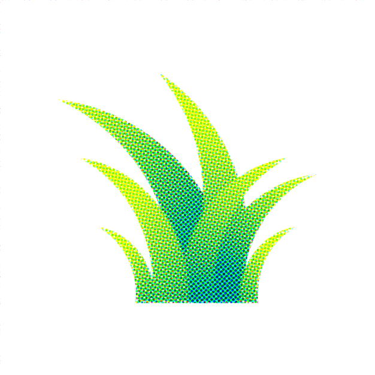
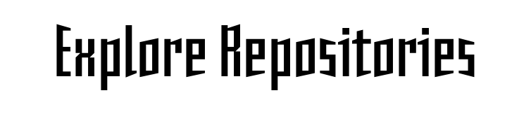

# GoTechGrass

**Build fast. Ship useful things. Touch grass.**

Open-source projects, experiments, and ideas built with curiosity.

 

---

## What We Build

Artificial Intelligence  
Deep Learning & Machine Learning  
Developer Tools  
Computer Vision  
Automation  
Creative Technology  
Experimental Projects

---

## The Idea

**Build something.**  
**Learn from it.**  
**Ship it.**  
**Then go touch grass.**

---

## Open Source

Everything here is built to be explored, learned from, improved, and shared.

**Have an idea? Build it with us.**

 

---

### Build. Ship. Touch Grass

